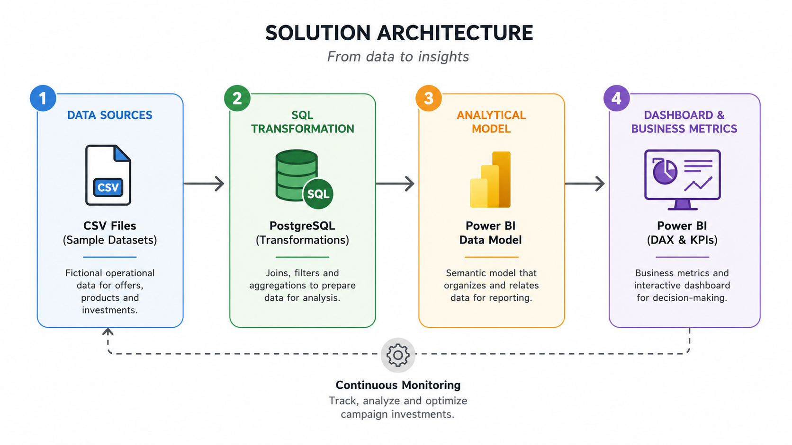
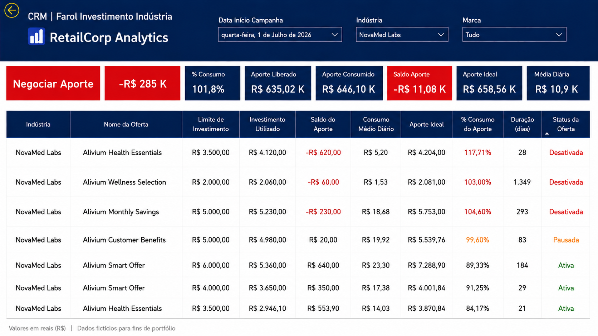

# 📊 Tracking Investment

Analytics Engineering project developed to monitor and optimize CRM campaign investment consumption through interactive dashboards and business-driven metrics.

---

## Project Overview

Tracking Investment is an end-to-end analytics project that simulates a real-world solution for monitoring promotional campaign budgets.

The project combines SQL, PostgreSQL and Power BI to transform operational campaign data into actionable business insights, supporting investment optimization throughout the campaign lifecycle.

---

## Tech Stack

| Technology | Purpose |
|------------|---------|
| PostgreSQL | Data storage |
| SQL | Data extraction and transformation |
| Power BI | Dashboard development |
| DAX | Business metrics and calculations |
| CSV | Sample datasets |

## Business Problem    

CRM campaigns receive predefined investment budgets that must be consumed during their active period.

Without centralized monitoring, campaign performance becomes difficult to track, making it challenging to identify underutilized budgets, campaigns approaching their investment limit, or opportunities to redistribute available funds.

As a result, decision-making depends on manual analysis, increasing operational effort and reducing the efficiency of investment management.

## Solution Overview

Tracking Investment was designed as an end-to-end analytics solution that centralizes campaign, product and investment data into a single analytical model.

The solution enables continuous monitoring of campaign budgets, supports proactive investment management and provides business indicators to identify optimization opportunities throughout the campaign lifecycle.

By combining SQL transformations, a semantic model in Power BI and business rules implemented with DAX, the project delivers reliable metrics for operational and strategic decision-making.

## Solution Architecture

The solution follows a simple analytical pipeline, transforming fictional operational data into business insights through SQL and Power BI.

The architecture is composed of four main layers:

1. Data Sources
2. SQL Transformation
3. Analytical Model
4. Dashboard & Business Metrics

## Key Features

The solution was designed to support proactive investment management through business-oriented indicators and operational monitoring.

Main capabilities include:

- Campaign investment consumption monitoring
- Budget utilization forecasting
- Remaining investment calculation
- Campaign status tracking
- Investment optimization opportunities
- Standardized operational export

## Investment Tracking Dashboard

The dashboard supports campaign investment monitoring through two complementary business perspectives:

- **Vendor-funded campaigns:** monitors investments funded by manufacturers, supporting budget consumption analysis and optimization opportunities.

- **Retailer-funded campaigns:** monitors internally funded campaigns using the same analytical model and business rules, differing only by the investment funding source.

Both perspectives share the same KPIs, calculations and decision-making process.

